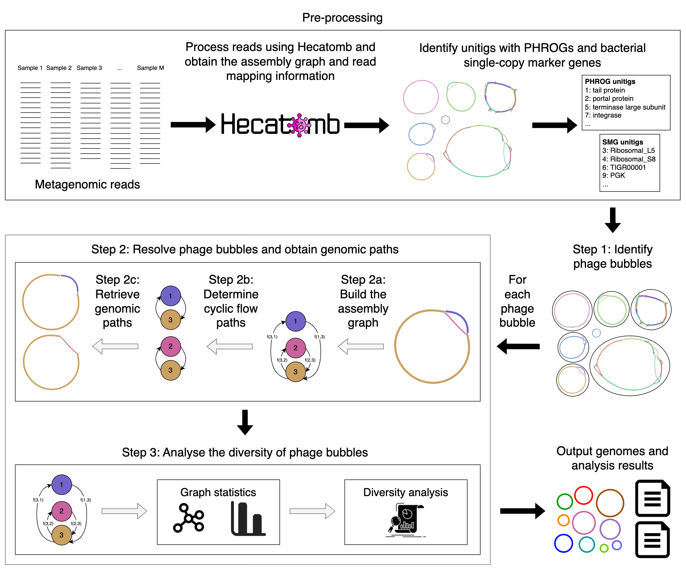

<p align="center">
  
</p>

# Phables: Phage bubbles resolve bacteriophage genomes from metagenomic data

`phables` is a tool developed to resolve bacteriophage genomes using phage bubbles in metagenomic data. It models cyclic phage-like components in the metagenomic assembly as flow networks and resolves genomic paths corresponding to flow paths determined. 

The figure below depicts the workflow of Phables.



`phables` requires the assembly output from [Hecatomb](https://hecatomb.readthedocs.io/en/latest/). 

## Setting up phables

### Downloading phables

You can clone the `phables` repository to your machine.

```
git clone https://github.com/Vini2/phables.git
```

Now go into the `phables` folder using the command

```
cd phables/
```

### Using `conda`

Once you have installed `conda`, make sure you are in the `phables` folder. Now run the following commands to create a `conda` environment and activate it to run `phables`.

```
conda env create -f environment.yml
conda activate phables
```

### Using `pip`
You can run the following command to install phables using `pip`. Make sure you are in the `phables` folder.

```
pip install .
```

### Test the setup

After setting up, run the following command to ensure that `phables` is working.

```
phables --help
```

## Usage

You can see the following command-line options of `phables` using `python phables --help`.

```
Usage: phables [OPTIONS]

  Phables: Phage bubbles resolve bacteriophage genomes in viral metagenomic
  samples.

Options:
  -g, --graph PATH          path to the assembly graph file  [required]
  -p, --paths PATH          path to the assembly path info file  [required]
  -c, --coverage PATH       path to the coverage file  [required]
  -b, --bampath PATH        path to the bam files  [required]
  -hm, --hmmout PATH        path to the .hmmout file  [required]
  -ph, --phrogs PATH        path to the phrog annotations file  [required]
  -ml, --minlength INTEGER  minimum length of circular unitigs to consider
  -mcov, --mincov INTEGER   minimum coverage of paths to output
  -cc, --compcount INTEGER  maximum unitig count to consider a component
  -mp, --maxpaths INTEGER   maximum number of paths to resolve for a component
  -mgf, --mgfrac FLOAT      length threshold to consider single copy marker
                            genes
  -as, --alignscore FLOAT   minimum alignment score (%) for phrog annotations
  -si, --seqidentity FLOAT  minimum sequence identity for phrog annotations
  -o, --output PATH         path to the output folder  [required]
  --help                    Show this message and exit.
```

### Example usage

```
phables -g assembly_graph.gfa -p assembly_info.txt -hm edges.fasta.hmmout -ph phrog_annot.tsv -c coverage.tsv -b bam_files/ -o /output/path/
```
