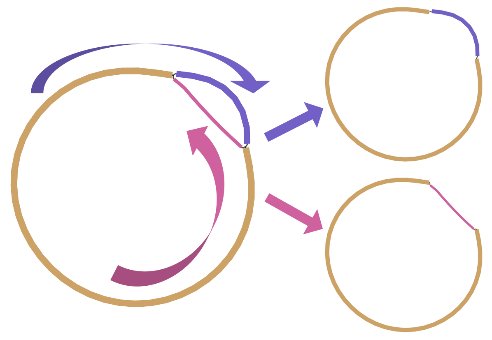

<p align="center">
  
</p>

# PhaBles: Phage bubbles resolve bacteriophage genomes from metagenomic data

`phables` is a tool developed to resolve bacteriophage genomes using phage bubbles in metagenomic data. It models phage-like components in the metagenomic assembly as graphs, detects cycles and resolves genomic paths corresponding to those cycles. 

The figure below shows an example component where two genomic paths are resolved. There are two branching contigs (in pink and purple) shared by the common brown contig. The two genomic paths formed by the pink contig and the purple contigs can be resolved as shown.



`phables` requires the the assembled contigs and assembly graph files from [Hecatomb](https://hecatomb.readthedocs.io/en/latest/). 

## Usage

You can see the following command-line options of `phables.py` using `python phables.py --help`.

```
Usage: phables.py [OPTIONS]

  PhaBles: Resolve bacteriophage genomes from phage bubbles in
  metagenomic data.

Options:
  -g, --graph PATH          path to the assembly graph file  [required]
  -c, --contigs PATH        path to the contigs file  [required]
  -p, --paths PATH          path to the contig paths file  [required]
  -hm, --hmmout PATH        path to the contig .hmmout file  [required]
  -ph, --phrogs PATH        path to the contig phrog annotations file
                            [required]

  -cov, --coverage PATH     path to the coverage file  [required]
  -ml, --minlength INTEGER  minimum length of circular contigs to consider
  -mcov, --mincov INTEGER   minimum coverage of paths to output
  -cc, --compcount INTEGER  maximum contig count to consider a component
  -mgf, --mgfrac FLOAT      length threshold to consider single copy marker
                            genes

  -as, --alignscore FLOAT   minimum alignment score (%) for phrog annotations
  -si, --seqidentity FLOAT  minimum sequence identity for phrog annotations
  -o, --output PATH         path to the output folder  [required]
  --help                    Show this message and exit.
```

### Example usage

```
python phables.py -g assembly_graph.gfa -c assembly.fasta -p assembly_info.txt -hm edges.fasta.hmmout -ph phrog_annot.tsv -cov coverage.tsv -o /output/path/
```
