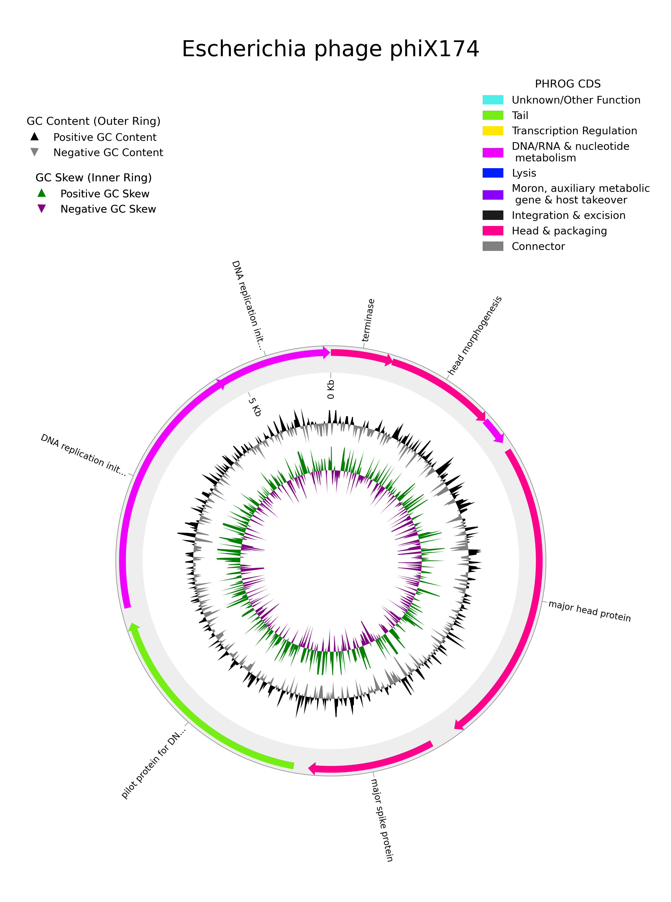

# Phage Genome Annotation

Once you have identified the high-quality and complete genomes from the [CheckV results](https://phables.readthedocs.io/en/latest/quality/), you can annotate them using a tool such as [**pharokka**](https://github.com/gbouras13/pharokka). The following sections will walk you through how to setup and run pharokka.

## Installing pharokka

The recommended way to install pharokka is using [`conda`](https://docs.conda.io/en/latest/).

```bash
# Create a new conda environment and install pharokka
conda create -n pharokka -c bioconda pharokka

# Activate pharokka conda environment
conda activate pharokka
```

## Download and install the pharokka databases

```bash
install_databases.py -o <path/to/databse_dir>
```

## Running pharokka

Here is an example command to run pharokka on the complete and high-quality resolved genomes.

```bash
pharokka.py -i complete_hq_genomes.fasta -o pharokka_output  -t 16 -d <path/to/database_dir>
```

## Circular genome plot

You can use the `pharokka_plotter.py` implementation from pharokka to create circular genome plots with annotations.

Let's assume that you have already run pharokka on all of the complete and high-quality resolved genomes and the output is available in `pharokka_output`. You can pick one genome to plot. For example, let's consider the genome `phage_comp_280_cycle_1.fasta` which is *phiX174*.

We start by reorienting the genome to start from the `terminase large subunit`. You can look up the starting position and strand of the `terminase large subunit` from the output file `pharokka_output/pharokka_cds_final_merged_output.tsv`. For example, let's take the starting position as 617 on the positive strand. You can run pharokka again for this genome with reorientation as follows.

```bash
pharokka.py -i resolved_phages/phage_comp_280_cycle_1.fasta -o pharokka_output_phage_comp_280_cycle_1 -d <path/to/databse_dir> -t 16 --terminase --terminase_strand 'pos' --terminase_start 617
```

Then you can run the plotting command as follows.

```bash
pharokka_plotter.py -i resolved_phages/phage_comp_280_cycle_1.fasta -n phage_comp_280_cycle_1_plot -o pharokka_output_phage_comp_250_cycle_1 -t "Escherichia phage phiX174"
```

