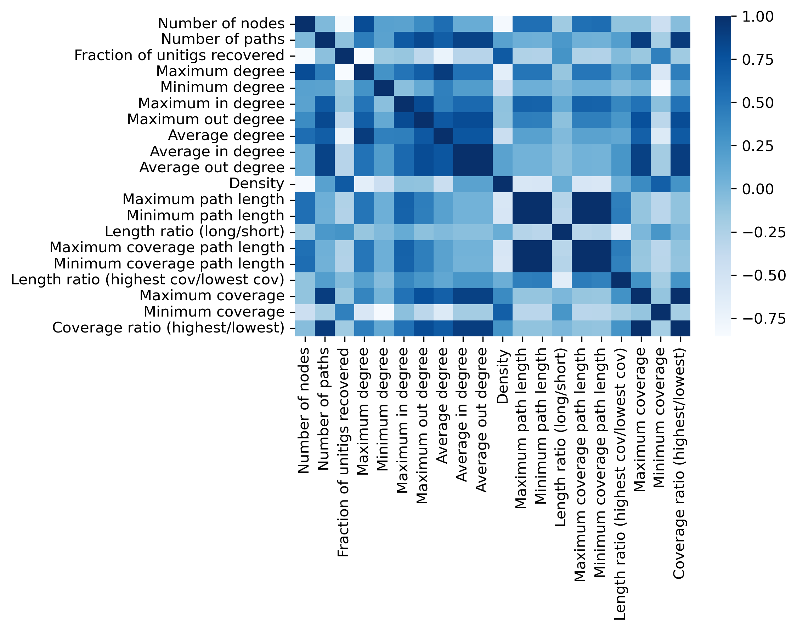
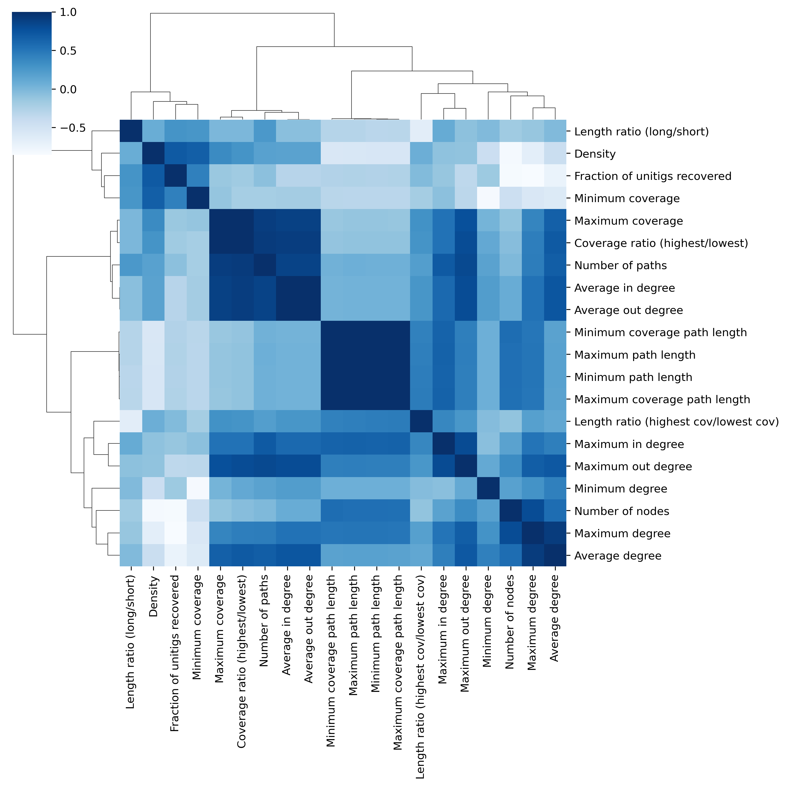

# Graph Statistics

Phables outputs a file named `resolved_component_info.txt` that contains the following information of the phage bubbles resolved.

* Number of nodes
* Number of paths resolved
* Fraction of unitigs recovered in the paths
* Maximum degree of the graph
* Maximum in degree of the graph
* Maximum out degree of the graph
* Average degree of the graph
* Average in degree of the graph
* Average out degree of the graph
* Density of the graph
* Maximum path length - length of the longest path
* Minimum path length - length of the shortest path
* Length ratio (long/short) - (Maximum path length / Minimum path length)
* Maximum coverage path length - length of the path with the highest coverage
* Minimum coverage path length - length of the path with the lowest coverage
* Length ratio (highest cov/lowest cov) - (Maximum coverage path length / Minimum coverage path length)
* Maximum coverage
* Minimum coverage
* Coverage ratio (highest/lowest) - (Maximum coverage / Minimum coverage)

You can compare and visualise the graph statistics of the resolved components using this information. The following example code shows how to visualise the results using Python.

## Importing Python packages

Assuming you have installed Python and the packages `matplotlib`, `pandas` and `seaborn`, let's import the following.

```python
import pandas as pd
import seaborn as sns
import matplotlib.pyplot as plt
```

## Load the data

Now we will load the `resolved_component_info.txt` file into a dataframe called `component_stats`.

```python
# Load the resolved_component_info.txt from Phables results
component_stats = pd.read_csv("resolved_component_info.txt", delimiter="\t", header=0)
```

You can list the columns using `component_stats.columns`. The following columns will be listed.

```python
Index(['Component', 'Number of nodes', 'Number of paths',
       'Fraction of unitigs recovered', 'Maximum degree', 'Maximum in degree',
       'Maximum out degree', 'Average degree', 'Average in degree',
       'Average out degree', 'Density', 'Maximum path length',
       'Minimum path length', 'Length ratio (long/short)',
       'Maximum coverage path length', 'Minimum coverage path length',
       'Length ratio (highest cov/lowest cov)', 'Maximum coverage',
       'Minimum coverage', 'Coverage ratio (highest/lowest)'],
      dtype='object')
```

## Plot histograms

You can plot histograms of the different columns. The following code plots a histogram of the `Number of nodes` column.

```python
# Get the column
df = component_stats["Number of nodes"]

# Plot the histogram
ax = df.plot.hist(bins=100, alpha=0.5, figsize=(12, 8))

# Set axis titles
ax.set(xlabel='Number of nodes', ylabel='Frequency')

# Save figure
plt.savefig("histogram_n_nodes.png", format='png', dpi=300, bbox_inches='tight')
```


## Plot heatmaps

You can plot heatmaps for correlations of all the graph statistics as follows.

```python
# Use Pearson correlation
df_cor = component_stats.corr(method='pearson')

# Plot heatmap
sns.heatmap(df_cor, cmap="Blues")

# Save figure
plt.savefig("pearson_heatmap.png", format='png', dpi=300, bbox_inches='tight')
```



## Plot hierarchically-clustered heatmaps

As the heatmap above looks a bit messy and hard to interpret, we can clean it up by clustering so we can observe some patterns. For this we can use the `clustermap` function from seaborn which produces a hierarchically-clustered heatmap.

```python
# Plot the hierarchically-clustered heatmap
pearson_clustermap = sns.clustermap(df_cor, cmap="Blues", method="ward")

# Save figure
pearson_clustermap.savefig("pearson_clustermap.png", format='png', dpi=300, bbox_inches='tight')
```

