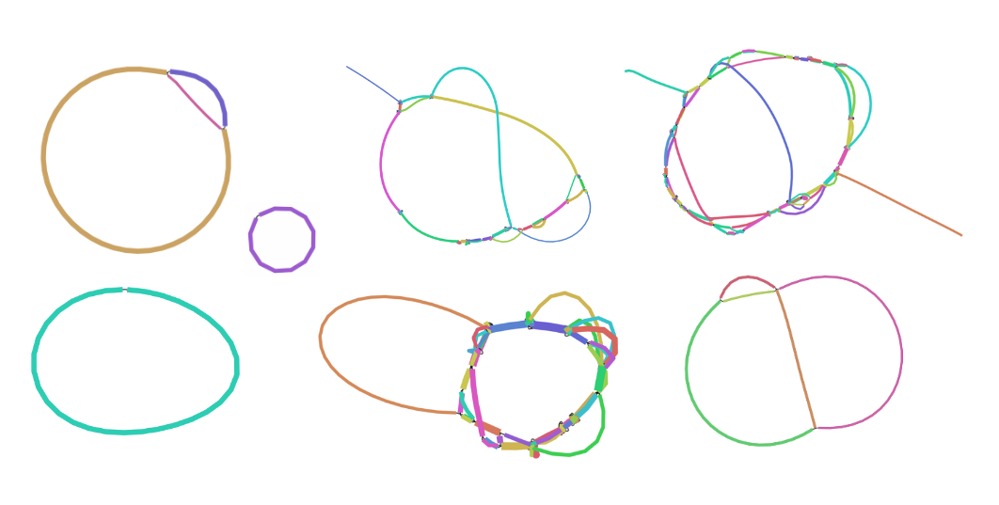

# Phables: from fragmented assemblies to high-quality bacteriophage genomes

Phables is a tool developed to resolve bacteriophage genomes using phage bubbles in viral metagenomic data. 
It models phage-like components in a viral metagenomic assembly graph as flow networks, models as a 
minimum flow decomposition problem and resolves genomic paths corresponding to flow paths determined. 
Phables uses the [Minimum Flow Decomposition via  Integer Linear 
Programming](https://github.com/algbio/MFD-ILP) implementation to obtain the flow paths.

## Motivation

Existing viral identification tools run contigs through a pre-trained model and predict whether or not they are of viral origin. However, contigs do not necessarily represent complete genomes as viral assemblies are not always perfect. Most of the existing metagenomic binning tools are optimised for bacterial metagenomes and cannot handle viral metagenomes efficiently.

We observed circular and linear components in viral metagenome assembly graphs as shown below (visualisations obtained from [Bandage](https://rrwick.github.io/Bandage/)), suggesting that viral genomes are fragmented and variant genomes exist.

Phables was developed to recover phage-like components called "phage bubbles" that represent one or more bacteriophage genomes and resolve phage bubbles to obtain complete and high-quality genomes.

## Workflow

Phables is powered by [Snaketool](https://github.com/beardymcjohnface/Snaketool) which packs in all the setup, testing, preprocessing and running steps into an easy-to-use pipeline. 

The following diagram shows an overview of Phables.

