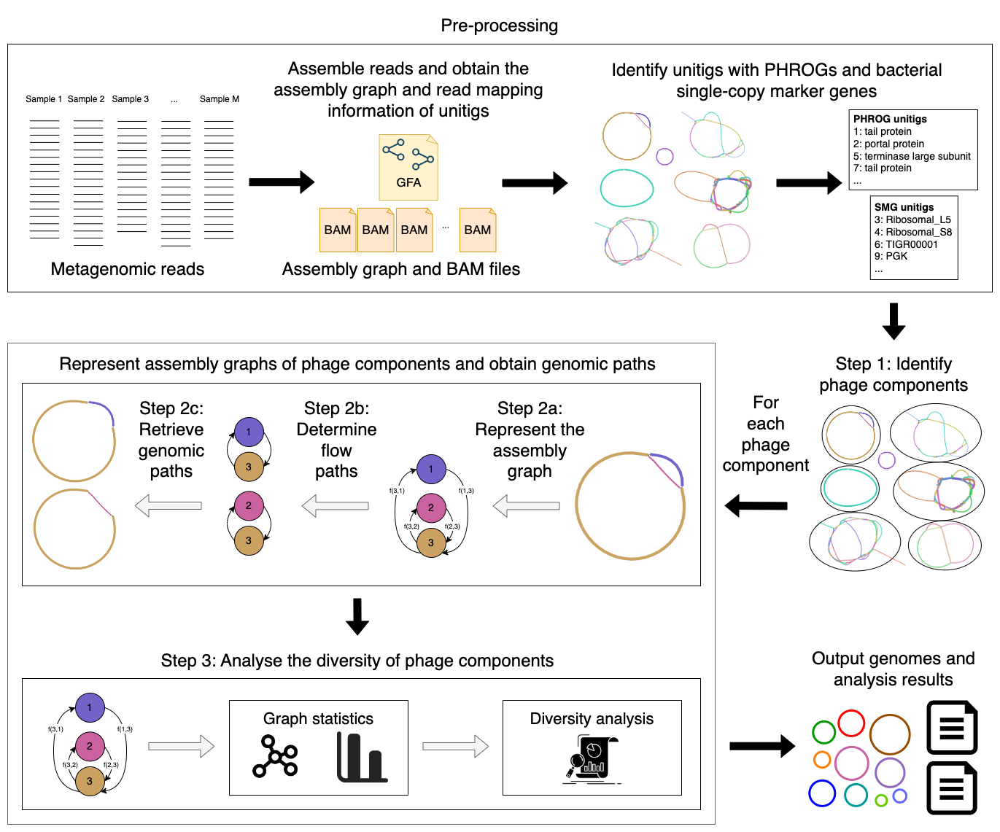

# Phage bubbles resolve bacteriophage genomes in viral metagenomic samples

Phables is a tool developed to resolve bacteriophage genomes using phage bubbles in viral metagenomic data. 
It models cyclic phage-like components in the viral metagenomic assembly as flow networks, models as a 
minimum flow decomposition problem and resolves genomic paths corresponding to flow paths determined. 
Phables uses the [Minimum Flow Decomposition via  Integer Linear 
Programming](https://github.com/algbio/MFD-ILP) implementation to obtain the flow paths.

